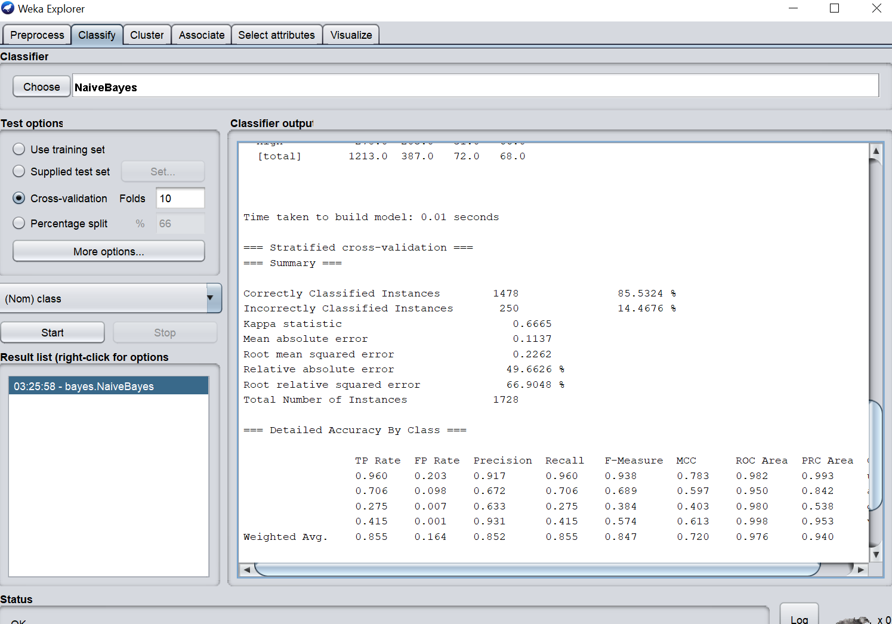

# Naive-Bayes

## **Implementation Details:**
I have implemented the Naïve Bayes algorithm using three data set stored in the Dataset folder. And applied k-fold cross validation on those three to find accuracy.
## **Naive Bayes Working:**
 It is a supervised learning algorithm. Where I used Mean, Standard Deviation, and Normal Distribution formula for calculating Likelihood.
So, for this, I first calculated the mean values and std—deviation for column according to class present for each value in the dataset. Then I have calculated the Likelihood with the help of the Normal Distribution formula using the value of every column of a row I have to predict for that class.
With this, I am now ready for the prediction of the new test dataset.
First, I will calculate the Likelihood with each class. And used the following formula.

## **10-Fold cross validation Working:**
-	Broken the data randomly into k groups.
-	Taken one of these groups and made it the test set. 
-	I have then Trained the model on the remaining groups and calculated the error on the test group. 
-	I have repeated this process 10 times and average all the results. That gave more accuracy.

## **Enhancements:**
1. **Added Log probabilities: -**
The calculated probabilities for each class are minimal for an attribute. When multiplied together, they give in way more minimal values, which can create floating-point underflow. Thus, I have added the log of the probabilities together.
2. **Used Label Encoding: -**
Label Encoding is a concept of turning the labels into a numeric form to transform it into a machine-readable pattern. It helps Machine learning algorithms to decide in a better way to operate those labels. It is one of the essential preprocessing steps for the structured dataset in supervised learning.

## **Comparison:**

Data Set Name | My Code Accuracy | WEKA Accuracy
-------------------- | ------------------------- | ----------------------
Hayes-Roth Data Set | 75.385% | 74.2424 %
Car Evaluation Data Set | 81.395% | 85.5324 %
Breast Cancer Data Set | 71.786% | 71.6783 %

### **Hayes-Roth Data Set:**
The result of My implemented accuracy is : 75.385% And Weka gives 74.2424 %. Hence my algorithm is bit more accurate than Weka.

***Screen short of my codes output:***

***Screen shot of WEKA :***

 

### **Car Evaluation Data Set :**
The result of My implemented accuracy is : 81.395%And Weka gives 85.5324 %. Hence Weka gives better accuracy than my algorithm implementation.

***Screen short of my codes output:***

***Screen shot of WEKA:***

### **Breast Cancer Data Set :**
The result of My implemented accuracy is : 71.786%And Weka gives 71.6783 %.Hence Weka gives same accuracy as my algorithm implementation.

***Screen short of my codes output:***

***Screen shot of WEKA:***

